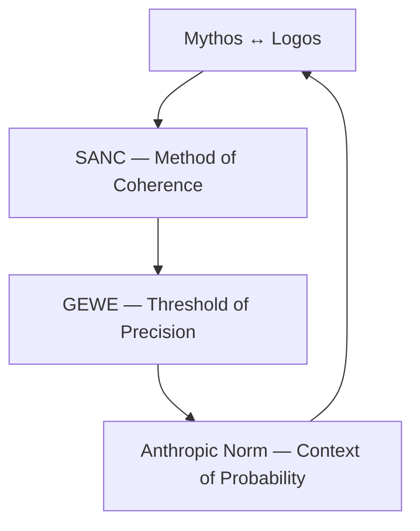

> [!quote] **“A world is not made by invention, but by coherence.”**  
> — *WCB Meta Axiom*

---

## 🪞 What Meta Is

**Meta** is the philosophical foundation of *World Crafting Basics (WCB).*  
It defines the *grammar of coherence* — how worlds remain believable, logical, and alive.  
While other WCB domains deal with matter, energy, or life, **Meta** governs the *mind* of creation:  
the standards of truth, clarity, and sufficiency that sustain immersion.

---

## 🧩 Reading Order

| **Order** | **File** | **Theme** | **Focus** |
|:--|:--|:--|:--|
| 1️⃣ | [[Principles — Integrity in Worldmaking]] | *Ethos* | Why coherence matters — the balance of mythos and logos. |
| 2️⃣ | [[The SANC Principles]] | *Method* | How to sustain coherence through clarity, sufficiency, and adaptability. |
| 3️⃣ | [[The GEWE Corollary]] | *Practice* | When precision stops serving plausibility — the “Good Enough” rule. |
| 4️⃣ | [[The Anthropic Norm and the Mediocritic Principle]] | *Context* | Where coherence meets the cosmos — why most things are ordinary most of the time. |

---

## 🧠 The Meta Flow

> **Conceptual Circuit**
> 
> - **Mythos ↔ Logos** → Establish intent  
> - **SANC** → Define method  
> - **GEWE** → Set threshold  
> - **Anthropic Norm** → Frame context  
> - **Loop closes:** Coherence becomes self-sustaining

> [!hint]
> *Meta is recursive.*  
> Each stage checks and refines the others.  
> - *Mythos* inspires, *Logos* stabilizes.  
> - *SANC* ensures clarity.  
> - *GEWE* enforces restraint.  
> - *Anthropic Norm* reminds us that reality itself favors the ordinary.

---

## 🧭 Cross-Domain Relevance

| **Domain** | **Meta Link** |
|:--|:--|
| **Ontics** | Defines *what exists* — Meta defines *why it matters.* |
| **Metrics** | Measures *how much* — Meta decides *how precise.* |
| **Morphotics** | Shapes *form* — Meta governs *clarity of representation.* |
| **Conformics** | Describes *material behavior* — Meta ensures *logical consistency.* |
| **Animotics** | Studies *life and equilibrium* — Meta maintains *philosophical continuity.* |
| **Milieutics** | Defines *context* — Meta keeps *context coherent with cause.*

---

> [!summary] **The Meta Mandate**
> - Coherence over correctness  
> - Clarity over complexity  
> - Sufficiency over perfection  
> - Adaptability over authority  
>  
> *Meta is not the science of worlds — it is the sanity of them.*

---

**Next →** [[Principles — Integrity in Worldmaking]]
